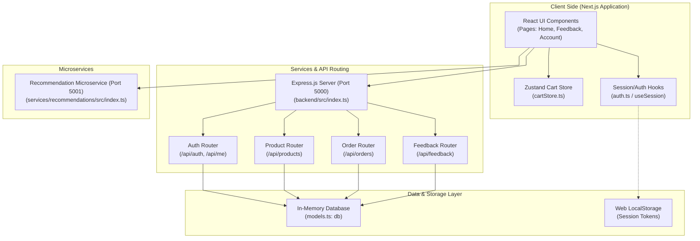
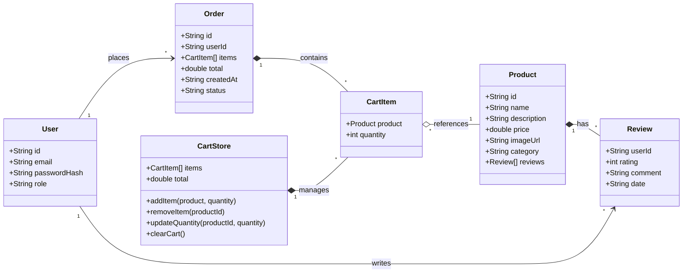
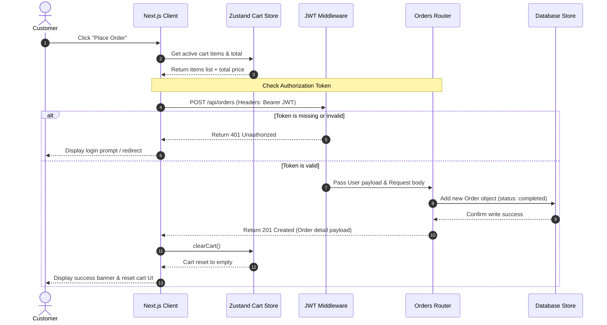
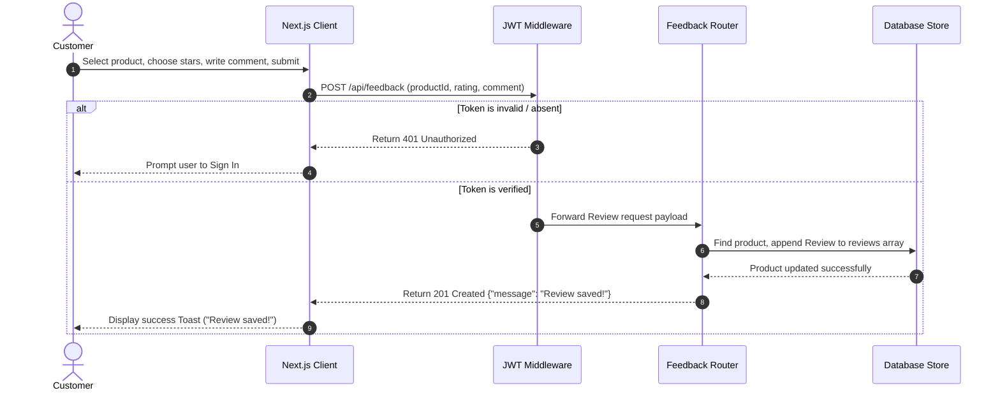
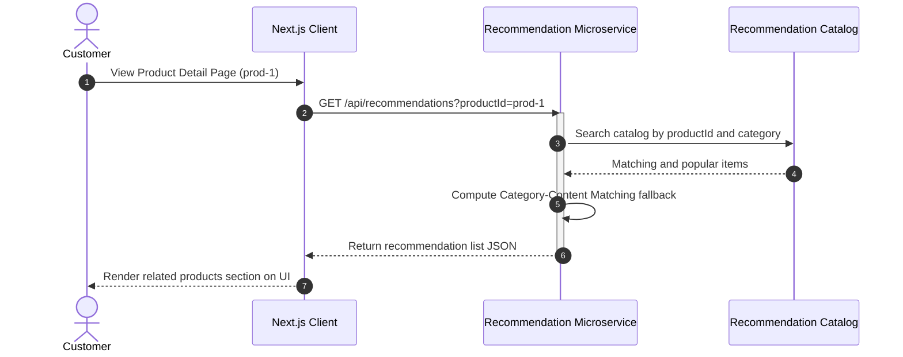

# SmartCart UML Design Diagrams

This document contains high-quality UML diagrams detailing the structural design, data schema, and interaction flows of the SmartCart application. To ensure maximum readability and follow specifications, all flowchart and architecture diagram connections render with **straight (non-curved) arrows**.

---

## 1. System Architecture (Component Diagram)

This component diagram shows the boundaries and dependencies between the Next.js client, Express.js API backend, the Recommendations microservice, and the storage layers.

---

## 2. Domain Data Model (Class Diagram)

This class diagram represents the structural interfaces and associations between the core entities (`User`, `Product`, `Review`, `Order`, `CartItem`) and the Zustand store client managers.

---

## 3. Order Checkout Workflow (Sequence Diagram)

Illustrates the step-by-step API message exchange between client components, backend middleware, and DB during checkout.

---

## 4. Product Feedback Submission Workflow (Sequence Diagram)

Illustrates the message exchange during rating and feedback review submissions.

---

## 5. Product Recommendation Retrieval Workflow (Sequence Diagram)

Illustrates how recommendation retrieval queries the separate Microservice when a customer views a product page.

