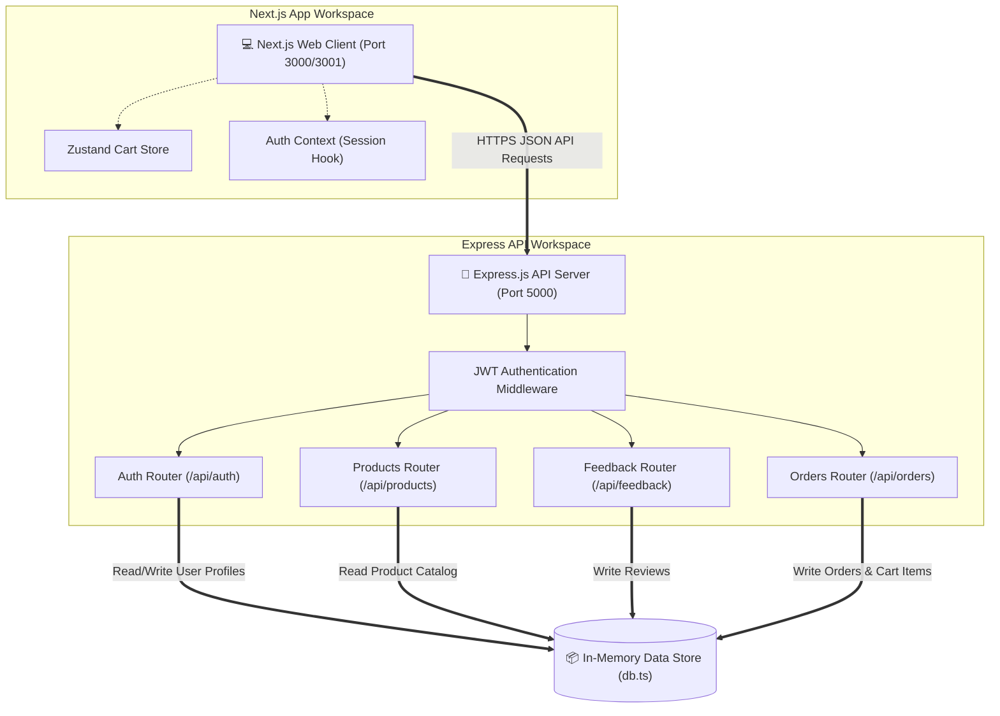
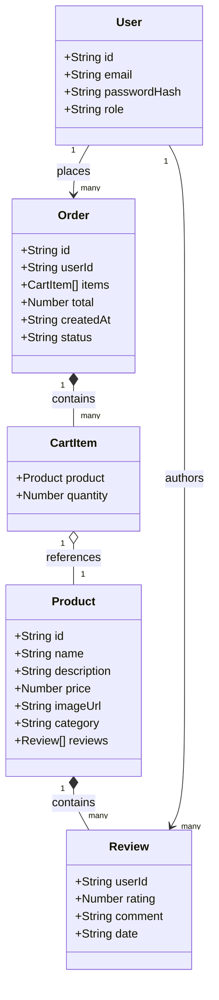
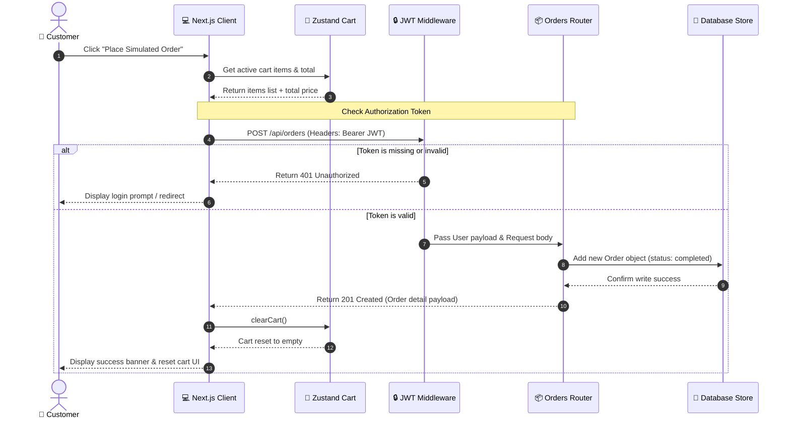
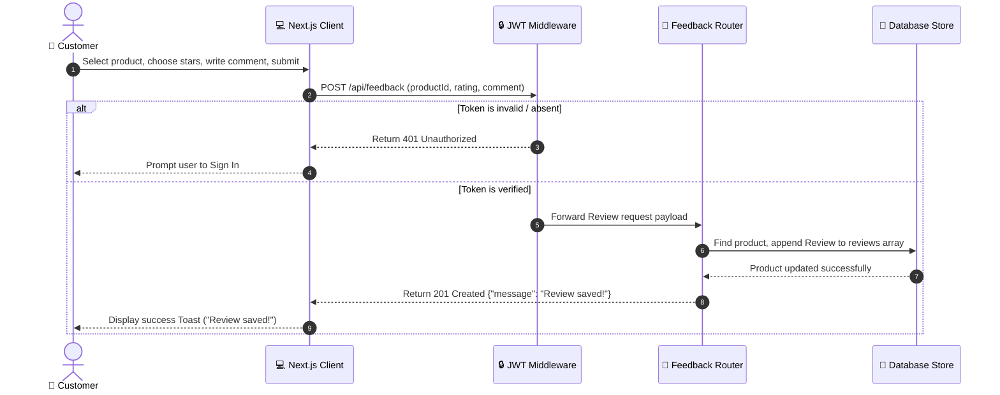

# SmartCart UML Design Diagrams

This document contains high-quality UML diagrams detailing the structural design, data schema, and interaction flows of the SmartCart monorepo application. 

---

## 1. System Architecture (Component Diagram)

Shows the structural boundaries and dependencies between the Next.js frontend client, the Express.js API backend, and the Database data layer.

---

## 2. Domain Data Model (Class Diagram)

Shows the structural interfaces, data attributes, and relational associations between the core entities (`User`, `Product`, `Review`, `Order`, and `CartItem`).

---

## 3. Order Checkout Workflow (Sequence Diagram)

Illustrates the step-by-step API message exchange between the client components, backend middleware, and DB during checkout.

---

## 4. Product Feedback Submission Workflow (Sequence Diagram)

Illustrates the message exchange during rating and feedback review submissions.

